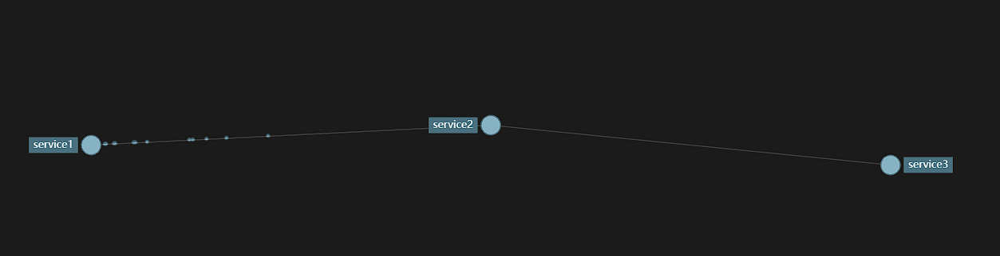

<h1>link-trace-study</h1>

# Zipkin

[官网地址](https://zipkin.io/)

[jar 下载地址](https://repo1.maven.org/maven2/io/zipkin/zipkin-server/)

Zipkin 是一个分布式跟踪系统。它有助于收集解决服务架构中的延迟问题所需的计时数据。功能包括此数据的收集和查找。Zipkin UI 提供了一个依赖关系图，显示每个应用程序经过了多少跟踪的请求。这有助于识别聚合行为，包括错误路径或对已弃用服务的调用。

**注意： Spring Boot 3 开始移除 Sleuth，核心被移到了 Micrometer Tracing **

## Sleuth + Spring Boot 2

- spring-boot：2.3.12.RELEASE
- spring-cloud：Hoxton.SR12
- alibaba-cloud：2.2.9.RELEASE

```xml
<?xml version="1.0" encoding="UTF-8"?>
<project xmlns="http://maven.apache.org/POM/4.0.0"
         xmlns:xsi="http://www.w3.org/2001/XMLSchema-instance"
         xsi:schemaLocation="http://maven.apache.org/POM/4.0.0 http://maven.apache.org/xsd/maven-4.0.0.xsd">
    <modelVersion>4.0.0</modelVersion>
    <parent>
        <groupId>org.springframework.boot</groupId>
        <artifactId>spring-boot-starter-parent</artifactId>
        <version>2.3.12.RELEASE</version>
        <relativePath/> <!-- lookup parent from repository -->
    </parent>

    <groupId>org.example</groupId>
    <artifactId>parent2</artifactId>
    <name>parent2</name>
    <description>parent2</description>
    <version>0.0.1-SNAPSHOT</version>
    <packaging>pom</packaging>

    <properties>
        <java.version>8</java.version>
        <spring-cloud.version>Hoxton.SR12</spring-cloud.version>
        <alibaba-cloud.version>2.2.9.RELEASE</alibaba-cloud.version>
    </properties>

    <dependencyManagement>
        <dependencies>
            <dependency>
                <groupId>org.springframework.cloud</groupId>
                <artifactId>spring-cloud-dependencies</artifactId>
                <version>${spring-cloud.version}</version>
                <type>pom</type>
                <scope>import</scope>
            </dependency>
            <dependency>
                <groupId>com.alibaba.cloud</groupId>
                <artifactId>spring-cloud-alibaba-dependencies</artifactId>
                <version>${alibaba-cloud.version}</version>
                <type>pom</type>
                <scope>import</scope>
            </dependency>
        </dependencies>
    </dependencyManagement>

    <dependencies>
        <dependency>
            <groupId>org.springframework.boot</groupId>
            <artifactId>spring-boot-starter-web</artifactId>
        </dependency>
        <!-- spring cloud -->
        <dependency>
            <groupId>org.springframework.cloud</groupId>
            <artifactId>spring-cloud-starter-openfeign</artifactId>
        </dependency>
        <dependency>
            <groupId>org.springframework.cloud</groupId>
            <artifactId>spring-cloud-starter-loadbalancer</artifactId>
        </dependency>
         <!-- nacos -->
        <dependency>
            <groupId>com.alibaba.cloud</groupId>
            <artifactId>spring-cloud-starter-alibaba-nacos-discovery</artifactId>
        </dependency>
        <!-- actuator -->
        <dependency>
            <groupId>org.springframework.boot</groupId>
            <artifactId>spring-boot-starter-actuator</artifactId>
        </dependency>
        <!-- zipkin -->
        <dependency>
            <groupId>org.springframework.cloud</groupId>
            <artifactId>spring-cloud-starter-zipkin</artifactId>
        </dependency>
    </dependencies>
</project>

```

```yaml
server:
  port: 8001
  servlet:
    context-path: /

spring:
  application:
    name: service1
  cloud:
    nacos:
      discovery:
        server-addr: 172.24.226.60:8848
      username: nacos
      password: nacos

  zipkin:
    sender:
      type: web
    base-url: http://172.24.226.60:9411
    service:
      name: service1
  sleuth:
    sampler:
      probability: 1
```

服务之间调用后，就会有链路记录




## Micrometer Tracing + Spring Boot3

[官方地址](https://micrometer.io/)
[中文网](https://springdoc.cn/spring-boot-3-observability/)

- spring-boot：3.2.3
- spring-cloud：2023.0.0
- alibaba-cloud：2022.0.0.0-RC2

```xml
<?xml version="1.0" encoding="UTF-8"?>
<project xmlns="http://maven.apache.org/POM/4.0.0"
         xmlns:xsi="http://www.w3.org/2001/XMLSchema-instance"
         xsi:schemaLocation="http://maven.apache.org/POM/4.0.0 http://maven.apache.org/xsd/maven-4.0.0.xsd">
    <modelVersion>4.0.0</modelVersion>
    <parent>
        <groupId>org.springframework.boot</groupId>
        <artifactId>spring-boot-starter-parent</artifactId>
        <version>3.2.3</version>
        <relativePath/> <!-- lookup parent from repository -->
    </parent>

    <groupId>org.example</groupId>
    <artifactId>parent3</artifactId>
    <name>parent3</name>
    <description>parent3</description>
    <version>0.0.1-SNAPSHOT</version>
    <packaging>pom</packaging>

    <modules>
        <module>../service1</module>
        <module>../service2</module>
        <module>../service3</module>
    </modules>

    <properties>
        <java.version>17</java.version>
        <spring-cloud.version>2023.0.0</spring-cloud.version>
        <alibaba-cloud.version>2022.0.0.0-RC2</alibaba-cloud.version>
        <micrometer-tracing.version>1.2.3</micrometer-tracing.version>
        <zipkin-reporter-brave.version>2.16.3</zipkin-reporter-brave.version>
    </properties>

    <dependencyManagement>
        <dependencies>
            <dependency>
                <groupId>org.springframework.cloud</groupId>
                <artifactId>spring-cloud-dependencies</artifactId>
                <version>${spring-cloud.version}</version>
                <type>pom</type>
                <scope>import</scope>
            </dependency>
            <dependency>
                <groupId>com.alibaba.cloud</groupId>
                <artifactId>spring-cloud-alibaba-dependencies</artifactId>
                <version>${alibaba-cloud.version}</version>
                <type>pom</type>
                <scope>import</scope>
            </dependency>
            <dependency>
                <groupId>io.micrometer</groupId>
                <artifactId>micrometer-tracing-bom</artifactId>
                <version>${micrometer-tracing.version}</version>
                <type>pom</type>
                <scope>import</scope>
            </dependency>
            <dependency>
                <groupId>io.zipkin.reporter2</groupId>
                <artifactId>zipkin-reporter-brave</artifactId>
                <version>${zipkin-reporter-brave.version}</version>
            </dependency>
        </dependencies>
    </dependencyManagement>

    <dependencies>
        <dependency>
            <groupId>org.springframework.boot</groupId>
            <artifactId>spring-boot-starter-web</artifactId>
        </dependency>
        <!-- openfeign -->
        <dependency>
            <groupId>org.springframework.cloud</groupId>
            <artifactId>spring-cloud-starter-openfeign</artifactId>
        </dependency>
        <dependency>
            <groupId>io.github.openfeign</groupId>
            <artifactId>feign-micrometer</artifactId>
        </dependency>
        <!-- loadbalancer -->
        <dependency>
            <groupId>org.springframework.cloud</groupId>
            <artifactId>spring-cloud-starter-loadbalancer</artifactId>
        </dependency>
        <!-- nacos -->
        <dependency>
            <groupId>com.alibaba.cloud</groupId>
            <artifactId>spring-cloud-starter-alibaba-nacos-discovery</artifactId>
        </dependency>
        <!--actuator -->
        <dependency>
            <groupId>org.springframework.boot</groupId>
            <artifactId>spring-boot-starter-actuator</artifactId>
        </dependency>
        <!-- micrometer tracing -->
        <dependency>
            <groupId>io.micrometer</groupId>
            <artifactId>micrometer-tracing</artifactId>
        </dependency>
        <!-- 桥接 -->
        <dependency>
            <groupId>io.micrometer</groupId>
            <artifactId>micrometer-tracing-bridge-brave</artifactId>
        </dependency>
        <!-- 上报 -->
        <dependency>
            <groupId>io.zipkin.reporter2</groupId>
            <artifactId>zipkin-reporter-brave</artifactId>
        </dependency>
    </dependencies>
</project>

```

```yaml
server:
  port: 8001
  servlet:
    context-path: /

spring:
  application:
    name: service1
  cloud:
    nacos:
      discovery:
        server-addr: 172.24.226.60:8848
      username: nacos
      password: nacos
# boot 3 配置
management:
  zipkin:
    tracing:
      endpoint: http://172.24.226.60:9411/api/v2/spans
  tracing:
    sampling:
      probability: 1.0
```

# SkyWalking

[官方地址](https://skywalking.apache.org/)

[腾讯云社区](https://cloud.tencent.com/developer/article/1736637)

## 后台

官网下载解压后，运行 `startup.sh` 启动


访问 `http://localhost:8080/` 


## 探针

下载解压


给程序添加 VM 选项配置

```tex
-javaagent:C:\Users\chris\Desktop\skywalking-agent\skywalking-agent.jar
-Dskywalking.agent.service_name=service1
-Dskywalking.agent.instance_name=service1
-Dskywalking.collector.backend_service=localhost:11800
```

启动程序，访问接口，就可以在后台看到链路


异常会显示为红色


点击进去可以看到堆栈信息


## traceId & logback

```xml
<dependency>
    <groupId>org.apache.skywalking</groupId>
    <artifactId>apm-toolkit-trace</artifactId>
</dependency>
<dependency>
    <groupId>org.apache.skywalking</groupId>
    <artifactId>apm-toolkit-logback-1.x</artifactId>
    <version>${skywalking-logback.version}</version>
</dependency>
```

```java
TraceContext.traceId()
```

# logback

`%tid` 只输出 traceId，`%sw_ctx` 可以输出上下文信息

[logback-skywalking-common.xml](service1\src\main\resources\logback-skywalking-common.xml)

[logback-spring.xml](service1\src\main\resources\logback-spring.xml)


